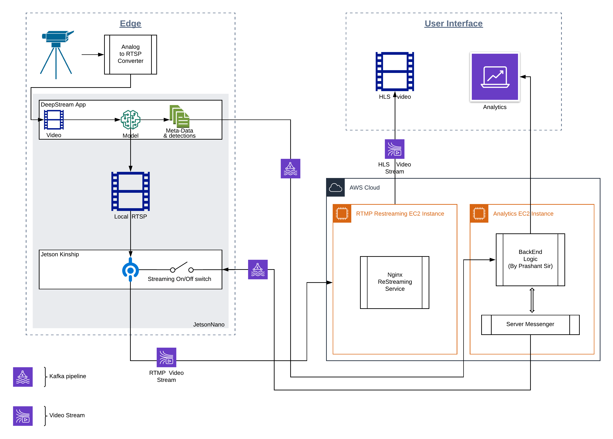

# Jetson-Pipeline-Map

Complete pipeline Architecture

## Introduction:

* The above map may look a little intimidating but please bear with me, this doc is a comprehensive guide which will make things crystal clear.

* This pipeline aims to accomplish most if not all objectives of the codenscious.ai's smart DVR project, later named Iceberg.

* This project aims to accomplish the following objectives:
    >1. Automate Surveillance of multiple CCTV cameras.
    >2. Provide on demand remote video stream to user.
    >3. Automatically generate alerts based on user defined rules.
    >4. Be a plug and play replacement of a common DVR.
    >5. Be close to if not less than in cost of a common DVR.
    >6. Be a standalone device.
    >7. The software that ships with this project is a SaaS app which runs on a subscription based model.

## Overview:

Here I will give a high level overview of how this whole pipeline works and later in this doc I will go over each part/module and cover three major things about each part viz.
>1. Current status of the Module.
>2. Steps to get the Module up and running.
>3. The improvements that should/could be made to the Module.

